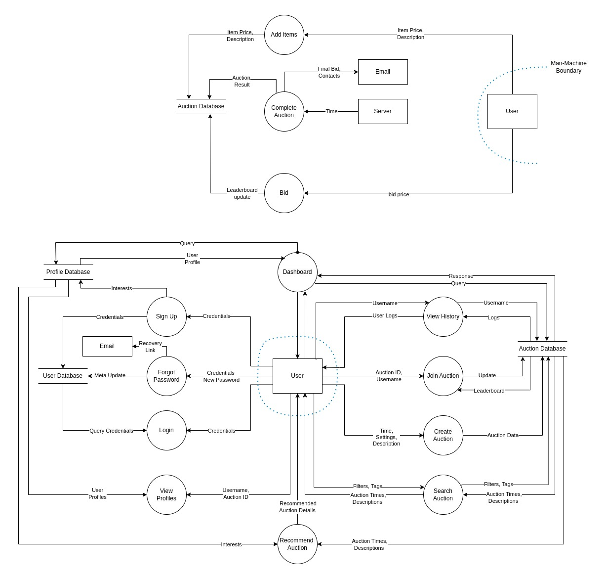

---
title: (G3) SRA for Auction Site
author: Suryaansh Jain, Rishit D, Rajiv Chitale, Anshul Sangrame
geometry: margin=2cm
--- 

# Function Point Analysis

The Unadjusted Function Point (UFP) is calculated as follows:  

UFP = $\sum_{i=1}^{5} \sum_{j=1}^{3}  w_{ij} c_{ij}$  
$w_{ij}$: Weight for a type of function  
$c_{ij}$: Number of function of that type  

The matrix given below contains weights used for FPA.  

+-------------------------------+-----+-----+------+
|                               | Low | Avg | High |
+===============================+=====+=====+======+
| External Input (EI)           | 3   | 4   | 6    |
+-------------------------------+-----+-----+------+
| External Output (EO)          | 4   | 5   | 7    |
+-------------------------------+-----+-----+------+
| Logical Internal File (LIF)   | 7   | 10  | 15   |
+-------------------------------+-----+-----+------+
| External Interface File (EIF) | 5   | 7   | 10   |
+-------------------------------+-----+-----+------+
| External Inquiry (EQ)         | 3   | 4   | 6    |
+-------------------------------+-----+-----+------+

Table below gives the description of each component and its type, complexity and weight.

| Component          | Description                                             | Type | Complexity | Weight |
|---------------------|---------------------------------------------------------|------|------------|--------|
| Sign Up             | Set name, username, password, contacts, interests       |  EI  |    Avg     |   4    |
| Log In              | Direct user to dashboard given correct credentials      |  EQ  |    Low     |   3    |
| Edit Profile        | Allows user to edit details of profile                  |  EI  |    Avg     |   4    |
| Forgot Password     | Allows user to reset password through contacts          |  EI  |    Low     |   3    |
| Create Auction      | List items + clauses and schedule auction time          |  EI  |    High    |   6    |
| Recommendations    | Provides user with auctions user might be interested in |  EO  |    Avg     |   5    |
| Search Options      | Allows user to search by tags, description, time, price |  EQ  |    High    |   6    |
| View History        | Allows user to view completed and scheduled auctions    |  EO  |    Avg     |   5    |
| View Other Profile  | Allows user to view profiles of other users             |  EQ  |    Avg     |   4    |
| Add Auction Items   | Allows auctioneer to add items for auction              |  EI  |    Avg     |   4    |
| Enter Auction       | Allows user to join auction room                        |  EO  |    High    |   7    |
| Make Bid            | Allows bidder to specify a price                         |  EI  |    Low     |   3    |
| Complete Auction    | Server selects and notifies the winner                  |  EO  |    Avg     |   5    |
| Exit Auction        | Allows user to exit auction room                         |  EI  |    Low     |   3    |
| Users File          | Contains user login details                              | LIF  |    Low     |   5    |
| Profile File        | Contains user profile and interests                      | LIF  |    Low     |   5    |
| Auction Data File   | Contains auction data and settings                       | LIF  |    Avg     |   10   |
| Auction Items File  | Contains description for auction items                   | LIF  |    Avg     |   10   |

UPF = 96  

The Complexity Adjustment Factor (CAF) is calculated as follows:  
CAF = 0.65 + 0.01 * $\sum_{i=1}^{14} f_{i}$

| Index | Property                         | Score |
| ----- | -------------------------------- | ----- |
| 1     | Reliable backup/recovery         | 4     |
| 2     | Data communication               | 5     |
| 3     | Distributed processing           | 1     |
| 4     | Performance critical             | 2     |
| 5     | Existing operational environment | 1     |
| 6     | Online data entry                | 5     |
| 7     | Input over multiple screens      | 3     |
| 8     | Master files updated online      | 4     |
| 9     | Complexity of data               | 2     |
| 10    | Complexity of processing         | 2     |
| 11    | Reusability                      | 2     |
| 12    | Installation included            | 3     |
| 13    | Multiple installation targets    | 2     |
| 14    | Ease of use, change              | 3     |

CAF = 0.65 + 0.01 * 39  
CAF = 1.04  

The Adjusted Function Points (FP) are calculated below:
FP = UFP * CAF  
FP = 96 * 1.04  
FP = 99.84  

# Context Diagram

A high level overview of the system is shown:  

# Data Flow Diagram

 