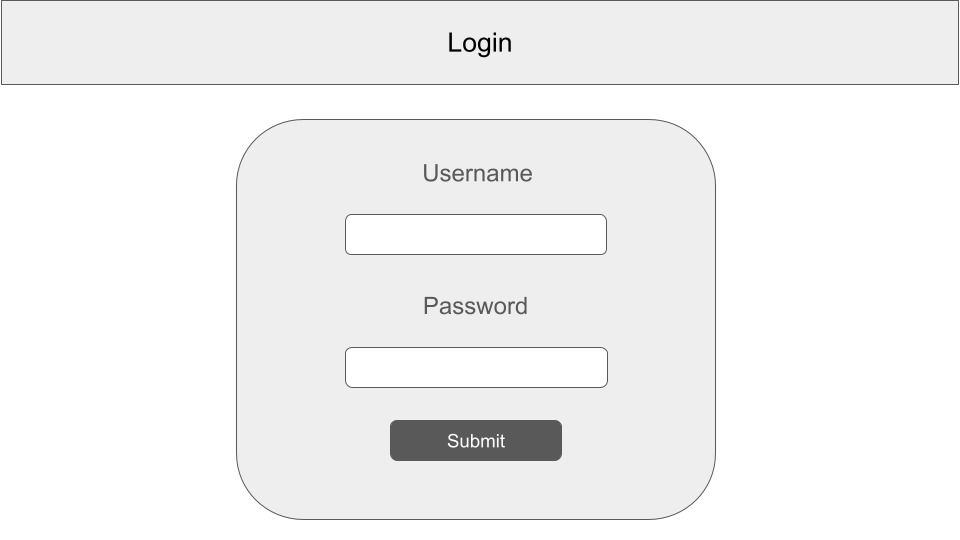
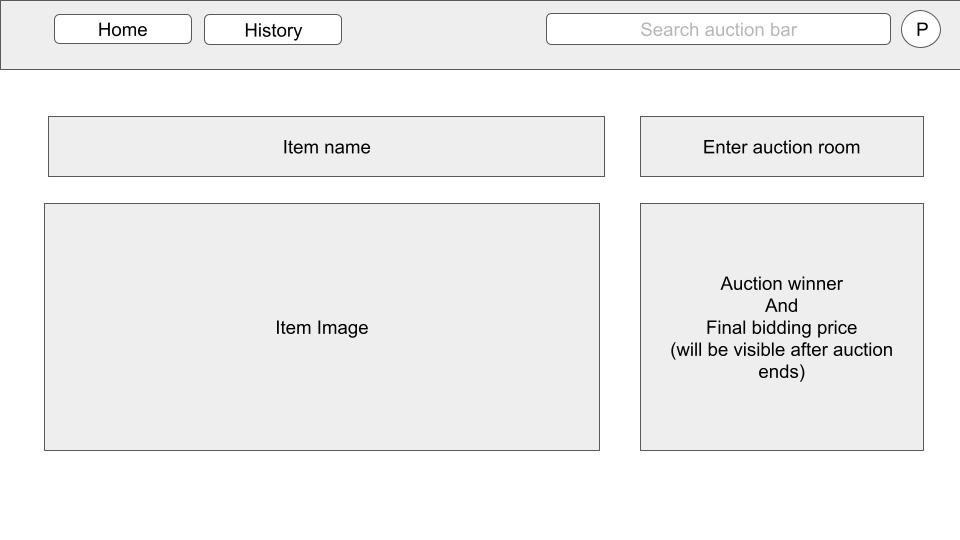
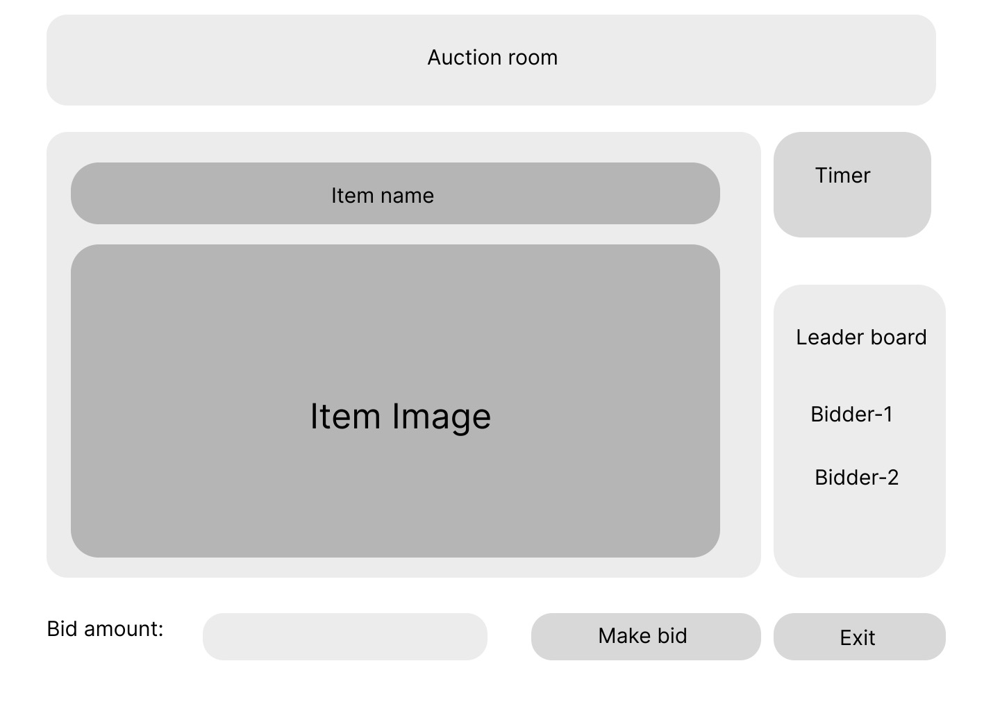
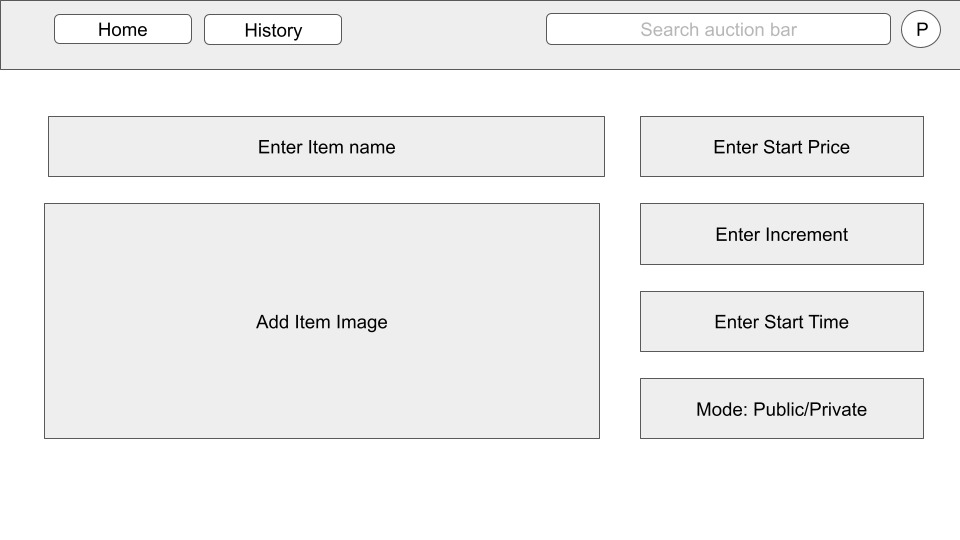
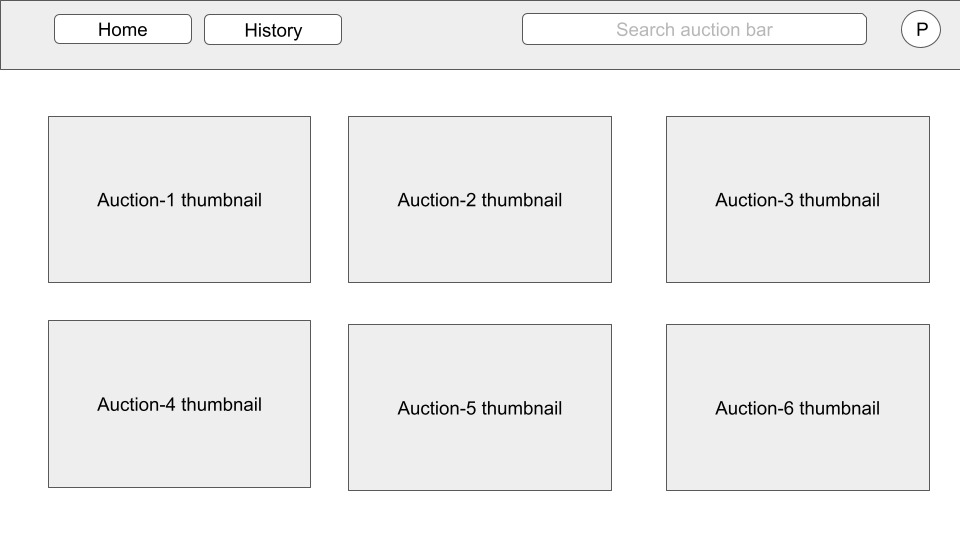

# [Introduction](#introduction)

The introduction section provides a high-level overview of the SRS document.

## [Purpose](#purpose)

The purpose of this document is to define the functional and non-functional requirements for the development of an Auction Site. It serves as a reference guide for the development team, stakeholders, and QA personnel involved in the project.

## [Scope](#scope)

The Auction Site aims to be a comprehensive online platform that facilitates auctions for a diverse range of items. It provides users with the ability to create, manage, and participate in auctions in real-time. The platform will feature robust security measures, efficient bidding mechanisms, and an intuitive user interface. Key features include user authentication, auction room creation, bidding, search functionality, recommendation systems, auction management, and viewing of auction history.

# [Overall Description](#overall-description)

This section offers a comprehensive overview of the system.

## [Product Perspective](#product-perspective)

The Auction Site operates as a standalone web application accessible via standard web browsers. It interfaces with databases for storing user data, auction information, and item details. The system also integrates with external services for authentication, recommendation systems, and payment processing.

## [Product Functions](#product-functions)

### User Management:

- Users can register with the site, providing necessary information for account creation.
- Secure authentication mechanisms will be implemented to safeguard user accounts and personal information.
- Users can manage their profiles, update information, and reset passwords if needed.

### Auction Room Management:

- Registered users can create new auction rooms, specifying auction types (public or private), duration, and item categories.
- Users can search and browse existing auction rooms based on various criteria such as category, popularity, and end time.
- Auctioneers have the authority to moderate and configure auction rooms, including setting starting bids, reserve prices, and auction rules.

### Bidding Functionality:

- Registered users can place bids on items within active auction rooms.
- The system will support real-time bidding updates and notifications to keep users informed of auction progress.
- Bids will be validated against predefined rules to ensure fairness and integrity.

### Search Feature:

- The platform will offer robust search capabilities, allowing users to find specific items or auction rooms based on keywords, categories, or attributes.
- Search results will be displayed in a structured manner, providing relevant item details and auction room information.

### Recommendation System:

- A recommendation engine based on the K-nearest neighbors (KNN) algorithm will provide personalized item suggestions to users based on their past activity, preferences, and bidding history.
- The recommendation system will enhance user engagement and satisfaction by showcasing relevant items of interest.

### Auction Management:

- Auctioneers have full control over auction proceedings, including the ability to start, pause, resume, and end auctions as necessary.
- The system will enforce predefined rules for auction closure, including automatic closure upon reaching the designated end time or meeting reserve prices.

### Auction History:

- Users can access their auction participation history, including details of items bid on, winning bids, and auction outcomes.
- Historical data will be stored securely and made accessible for reference and analysis purposes.

## [User Classes and Characteristics](#user-classes-and-characteristics)

### Bidder:

- Bidders are individuals interested in participating in auctions to acquire items of interest.
- They have varying levels of auction experience and preferences regarding item categories and bidding strategies.
- Bidders expect a seamless and secure bidding experience, with access to relevant information and real-time updates during auctions.

### Auctioneer:

- Auctioneers are responsible for managing and overseeing auction activities within the platform.
- They have expertise in auction management and are entrusted with setting auction parameters, moderating bidding activities, and ensuring compliance with auction rules and regulations.
- Auctioneers require comprehensive tools and functionalities to effectively host and administer auctions, including robust reporting and analytics capabilities.

# [Specific Requirements](#specific-requirements)

This section outlines detailed functional and non-functional requirements for the Auction Site.

## [Functional Requirements](#functional-requirements)

### User Management

- The system shall provide user registration functionality, requiring users to provide valid email addresses and secure passwords.
- User accounts shall be verified via email confirmation to prevent unauthorized access.
- Users shall have the option to update their profile information, including contact details and preferences.

---

#### Authentication:

|    Function     |                    Description                     |
| :-------------: | :------------------------------------------------: |
|     Sign Up     | Set name, username, password, contacts, interests  |
| Verify Account  |     Authenticate registration or password reset    |
|     Log In      | Direct user to dashboard given correct credentials |
|  Edit Profile   |       Allows user to edit details of profile       |
| Forgot Password |   Allows user to reset password through contacts   |

#### Dashboard:

|      Function      |                       Description                       |
| :----------------: | :-----------------------------------------------------: |
|   Create Auction   |     List items + clauses and schedule auction time      |
|  Recommendations   | Provides user with auctions user might be interested in |
|   Search Options   | Allows user to search by tags, description, time, price |
|    View History    |  Allows user to view completed and scheduled auctions   |
| View Other Profile |       Allows user to view profiles of other users       |

#### Auction Room:

|     Function      |                Description                 |
| :---------------: | :----------------------------------------: |
| Add Auction Items | Allows auctioneer to add items for auction |
|   Enter Auction   |      Allows user to join auction room      |
|     Make Bid      |      Allows bidder to specify a price      |
| Complete Auction  |   Server selects and notifies the winner   |
|   Exit Auction    |      Allows user to exit auction room      |

#### [Authentication Use-Cases](#authentication-use-cases)

- **Use Case 1:** Sign Up

  - _Primary Actor:_ User
  - _Preconditions:_ Internet connection, None
  - _Main Success Scenario:_
    1. User enters the website and is prompted to register themself on the website as an account if they are not registered.
    2. User is asked to give mandatory details such as username, password, name, email contact etc.
    3. User is also prompted to additional details such as mobile contact details, interests etc.
    4. User submits details and waits for _verification_.
  - _Exceptions:_
    1. User chooses an already existing username. User is then prompted to choose another username.
    2. User sets a password which has insufficient strength. User is then prompted to choose new password.
    3. Both instances of password do not match. User is then prompted to recheck passwords.
    4. All mandatory fields have not been filled. User is then prompted to fill all mandatory fields.

- **Use Case 2:** Log In

  - _Primary Actor:_ User
  - _Preconditions:_ Internet connection, Have a registered account
  - _Main Success Scenario:_
    1. User enters the website and is prompted to log in if they have been registered on the website.
    2. User is prompted to enter username and password to log on to the website.
    3. If correct credentials are provided, the user is directed to their dashboard page.
  - _Exceptions:_
    1. User enters incorrect credentials. User is then prompted to enter correct credentials.
    2. User forgets password and is prompted to the _forgot password_ routine.

- **Use Case 3:** Forgot Password

  - _Primary Actor:_ Server
  - _Preconditions:_ Internet connection, Called when user wants to verify account after registration
  - _Main Success Scenario:_
    1. The server sends a message via backup contacts - email or mobile.
    2. The user is prompted to click on a link from the afore-mentioned contacts to reset password.
    3. The user is then requested to confirm new password.
  - _Exceptions:_
    1. Both instances of password do not match. User is then prompted to recheck passwords.
    2. User sets a password which has insufficient strength. User is then prompted to choose new password.

- **Use Case 4:** Edit Profile

  - _Primary Actor:_ User
  - _Preconditions:_ Internet connection, User is logged in
  - _Main Success Scenario:_
    1. User clicks on profile details from the dashboard and chooses to edit profile details excluding username.
    2. User fills in new details in a form with details already filled in.
    3. User then submits details and profile changes are updated.
  - _Exceptions:_
    1. Mandatory fields are not filled. User is then prompted to fill all mandatory fields.

- **Use Case 5:** Verify Account
  - _Primary Actor:_ Server
  - _Preconditions:_ Internet connection, Called when user has completed filling registration details
  - _Main Success Scenario:_
    1. The server sends a message via backup contacts - email or mobile.
    2. The user is prompted to click on a link to redirect themselves to the website's dashboard. The user is also automatically logged in.
  - _Exceptions:_
    1. The link for verification has been timed out. User must re-register account.

#### [Dashboard](#dashboard)

- **Use Case 1:** Create Auction

  - _Primary Actor:_ User
  - _Preconditions:_ Internet connection, User is logged in
  - _Main Success Scenario:_
    1. User chooses to create an auction and schedule it for a stipulated time.
    2. User is then directed to a page which prompts user to enter details of the auction in stages.
    3. User is first prompted to enter details for all items to be presented in the auction. Every item is provided with a name, description, relevant tags, starting price, optional clauses attached etc.
    4. User is then prompted to enter general details for the auction. Details include minimum increment for each bid, start-time, end-time, return policies and other clauses.
    5. User is finally prompted to fill a questionnaire to generate the license for the auction.
  - _Exceptions:_
    1. Mandatory fields have not been filled. User is then prompted to fill missing mandatory fields.
    2. No items have been added. User is then prompted to add atleast one item in the auction.
    3. Time window entered has already started or passed. User is then prompted to enter a valid time-window.

- **Use Case 2:** Recommendations

  - _Primary Actor:_ Server
  - _Preconditions:_ Internet connection, User is logged in, presently at the dashboard
  - _Main Success Scenario:_
    1. User is shown a list of upcoming auctions which are relevant to user interests, search history, auction history etc.
    2. User can toggle _Number of Auctions per Page_ or click on _View More_ to view more auctions and their details if necessary.
    3. User can select one of the auctions to view details of all items listed on the auction.
    4. If interested and the auction is currently going on, the user can click on _Join_ to enter the virtual auction-room. The user is first shown the agreement clause to join the auction. The user must also accept the agreement clause before entering the auction-room.
  - _Exceptions:_
    1. User does not agree to the agreement clause. The user is then prompted to agree to the clauses.

- **Use Case 3:** Search Options

  - _Primary Actor:_ User
  - _Preconditions:_ Internet connection, User is logged in
  - _Main Success Scenario:_
    1. User is allowed to search for multiple relevant auctions by various fields. These fields include relevant tags, item description, start-time, end-time, starting prices, popularity (number of attendees) etc.
    2. User is then prompted to click _Search_ and is then presented with a list of relevant auctions.
    3. User can toggle _Number of Auctions per Page_ or click on _View More_ to view more auctions and their details if necessary.
    4. User can select one of the auctions to view details of all items listed on the auction.
    5. If interested and the auction is currently going on, the user can click on _Join_ to enter the virtual auction-room. The user is first shown the agreement clause to join the auction. The user must also accept the agreement clause before entering the auction-room.
  - _Exceptions:_
    1. No search filter is applied. The user is then prompted to make atleast one field non-empty.
    2. User does not agree to the agreement clause. The user is then prompted to agree to the clauses.
    3. No match occurs. The user is shown text conveying there are no matches and prompts them to enter alternate key words.

- **Use Case 4:** View Auction History

  - _Primary Actor:_ User
  - _Preconditions:_ Internet connection, User is logged in
  - _Main Success Scenario:_
    1. User chooses to view auction history by clicking on an appropriate link from the dashboard.
    2. The user is shown a list of auctions which the user has either attended or hosted.
    3. The user can select one of the auctions and is directed to the auction page details.
    4. Details include purchases made in the auction (if any), time spent on the auction date etc. (if the user participated in said auction)
    5. Details include purchasees, amount paid for all items sold in the auction, and other details entered by the user when the auction was scheduled.
  - _Exceptions:_
    1. No history exists. The user is prompted to search for auctions to join or is prompted to create an auction.

- **Use Case 5:** View Other Profiles
  - _Primary Actor:_ User
  - _Preconditions:_ Internet connection, User is logged in
  - _Main Success Scenario:_
    1. User can access pubic profile details by clicking usernames from auction detail pages or auction history pages.
    2. The user can access the auctions that other users have hosted or attended.

---

### Auction Management

- **Use Case 1:** Adding items for auction

  - _Primary Actor:_ Auctioneer
  - _Pre-condition:_ Internet connection, Auctioneer logged in
  - _Main Success Scenario:_
    1. The auctioneer clicks on the start new auction button.
    2. Opens up the page to fill in auction details.
    3. The auctioneer fills in the details of the items to be auctioned as well as the scheduled start time.
    4. The auctioneer also mentions whether he wants the auction to be public or private
    5. The auction is published on the website and the auctioneer is redirected to the auction page.
    6. The notification is sent to the auctioneer 5 minutes before the scheduled start time.
    7. If the auction is private, the notification is also sent to chosen bidders.
    8. At the scheduled start time server starts the auction by allowing bidders to click on the enter auction room button.

- **Use Case 2:** Entering an auction

  - _Primary Actor:_ bidder and auctioneer
  - _Pre-condition:_ Internet connection, user logged in, the user is allowed to enter the auction room
  - _Main Success Scenario:_
    1. The user clicks on enter auction button on the auction page
    2. The bidder is redirected to the auction room page where details of the auction as well as the leaderboard of the highest bidders will be displayed.

- **Use Case 3:** Make a bid

  - _Primary Actor:_ bidder
  - _Pre-condition:_ Internet connection, bidder logged in, the bidder has entered the auction room
  - _Main Success Scenario:_
    1. The bidder specifies the bid price
    2. The server accepts the bid price and updates the leaderboard accordingly.
  - _Alternate Scenario:_
    1. If the bid price is less than the current highest bid price then the server informs the bidder and asks to rebid.

- **Use Case 4:** Completing an auction

  - _Primary Actor:_ Server
  - _Pre-condition:_ Internet connection, bidder logged in, scheduled end time has reached
  - _Main Success Scenario:_
    1. The server selects the highest bidder.
    2. The server sends an email to the auctioneer and highest bidder regarding the final bid price and each other's contact details.
    3. The server publishes the highest bidder and final bid price on the auction page and adds the auction to history.
    4. All bidders are redirected to the auction page

- **Use Case 5:** Exiting an auction room
  - _Primary Actor:_ bidder and auctioneer
  - _Pre-condition:_ Internet connection, the user has entered the auction room
  - _Main Success Scenario:_
    1. The user clicks on the exit auction button
    2. The user is redirected to the auction page

### Bidding Functionality

- Users shall be able to place bids on items within active auction rooms, adhering to predefined bid increments and reserve prices.
- The system shall support real-time bidding updates and notifications, alerting users of competing bids and auction status changes.
- Bids shall be processed securely, with encryption protocols and transaction logging to ensure data integrity.

### Search Feature

- The search functionality shall allow users to search for specific items or auction rooms based on keywords, categories, and attributes.
- Search results shall be sorted based on relevance and displayed in a structured format for easy navigation.

### Recommendation System

- The recommendation engine shall analyze user behavior and historical data to generate personalized item suggestions.
- Recommendations shall be based on similarity metrics derived from user profiles, bidding patterns, and item characteristics.
- Users shall have the option to provide feedback on recommended items to improve future recommendations.

## Auction Management

- Auctioneers shall have the authority to start, pause, resume, and end auctions within designated auction rooms.
- The system shall enforce predefined rules for auction closure, including automatic closure upon reaching the designated end time or meeting reserve prices.
- Auction closure notifications shall be sent to all participants, with details of winning bids and the next steps for transaction completion.

## Auction History

- Users shall have access to their auction participation history, including details of items bid on, winning bids, and auction outcomes.
- Historical data shall be stored securely and made accessible for reference and analysis purposes.

## [Performance Requirements](#performance-requirements)

- The system shall support a minimum of 1000 concurrent users during peak usage periods.
- Response times for critical operations, such as bid placement and auction room creation, shall not exceed 0.5 seconds under normal load conditions.
- The platform shall be scalable and capable of handling increased user traffic and auction activity without degradation in performance.

## [Design Constraints](#design-constraints)

- *Security*: The system shall implement robust security measures to protect user data and prevent unauthorized access. 
- *Fault Tolerance*: The system shall be designed to handle unexpected errors and failures, with appropriate error handling and recovery mechanisms. The Auction data for an ongoing auction must be preserved to ensure that the auction can be resumed in case of a server failure.
- *Prevent Robot Bidding*: The system shall implement mechanisms to prevent robot bidding.

# [Future Extensions](#future-extensions)

This section identifies potential enhancements and future development opportunities for the Auction Site, including but not limited to:

- Integration with third-party payment gateways for secure transaction processing.
- Implementation of advanced analytics and reporting tools for auction performance analysis.
- Expansion of recommendation systems to incorporate machine learning algorithms and collaborative filtering techniques.
- Integration with social media platforms.
- Add cryptocurrency payment options for anonymous transactions and auction participation.

for enhanced user engagement and marketing opportunities.

# [Appendix](#appendix)

## [Appendix A: The User Screens](#appendix-a-the-user-screens)

This appendix contains mockups of user interface screens for reference, including login screens, auction room views, bidding interfaces, and user profile pages.

