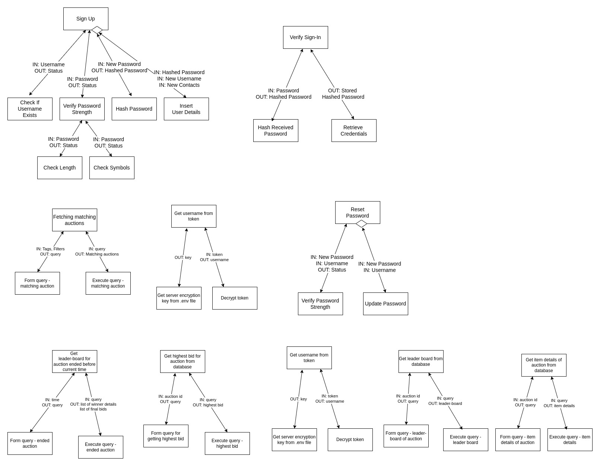

# Overview
## Software
Our software aims to provide an end-to-end solution for customers participating in online auctions. We provide personalized interfaces for all users taking into account their preferences and auction history. We allow prospective auctioneers to declare items and schedule auctions at their convenience. Our software provides for multiple bidders to join auction rooms, leave auction rooms and bid for items of interest.

## Design
This document encapsulates our data-flow-diagrams, their abstract inputs and outputs along with the appropriate structured charts and their comprising modules. We also specify each module type and its predicted complexity in the system in terms of cohesiveness and coupling. This document highlight possible bottlenecks and error-prone modules with intuitive reasoning and mathematical analysis. We also consider the tentative lines-of-code (LoC) for every input, transform and output subsystems./
We summarize our software through an interface sketch comprising of relevant classes, attributes, methods and inheritances.

# Data Flow Diagrams
We elucidate the data-flow of our software through the following diagrams. To simplify our data-flow and modularize our application we effectively split our software into three very loosely coupled systems - authentication, general utilities and auction-room management. We have also highlighted the most abstract inputs and outputs for each of these subsystems in their reprective diagrams.

# Structured Charts
We now list sequentially modules formed from the abforementioned data-flow duagrams via factoring at different levels and the final structured chart with all modules combined.

## First Level Factored Modules

## Factored Input Modules

## Factored Output Modules

## Factored Transform Modules

## Final Structured Chart

# Design Analysis
## List of Modules
We list our final factored modules in the table below with corresponding type of module and cohesion, and its estimated size.

|   Module Name             |   Module Type     |   Cohesion Type       |   Estimated Size  |
| -----------------         | ----------------- | -----------------     | ----------------- |
| Decrypt+Verify Reset Link |   Input           | Functional            |        50         |  
| Get New Password          |   Input           | Functional            |        50         |
| Reset Password            |   Coordination    | Functional            |        50         |  
| Verify Password Strength  |   Input           | Functional            |        20         |
| Update Password           |   Output          | Functional            |        50         | 
| Confirm Reset Status      |   Output          | Functional            |        25         | 
| Get contact (email)       |   Input           | Functional            |        50         |
| Send Reset Link           |   Output          | Functional            |        75         | 
| Get new profile details   |   Input           | Functional            |        100        |
| Get Location              |   Input           | Functional            |         25        |
| Get Age                   |   Input           | Functional            |         25        |
| Get Topics of Interest    |   Input           | Functional            |         50        |
| Get Sign Up Details       |   Input           | Functional            |        100        |
| Get Username              |   Input           | Functional            |         25        |
| Get New Password          |   Input           | Functional            |         25        |
| Get Contact               |   Input           | Functional            |         25        |
| Sign Up                   |   Transform       | Functional            |         50        |
| Check If Username Exists  |   Transform       | Functional            |         50        |
| Check Length              |   Transform       | Functional            |         15        |
| Check Symbols             |   Transform       | Functional            |         15        |
| Hash Password             |   Transform       | Functional            |         15        |
| Insert User Details       |   Output          | Functional            |         50        | 
| Display Sign Up Status    |   Output          | Functional            |        150        | 
| Get Sign-In Details       |   Input           | Functional            |        150        |
| Verify Sign-In            |   Transform       | Functional            |         50        |
| Retrieve Credentials      |   Input           | Functional            |         50        |
| Generate Token or Failure |   Output          | Functional            |        150        | 
| Store Token in Browser    |   Output          | Functional            |         50        | 
| Display Sign-In Failure   |   Output          | Functional            |         50        | 

|   Module Name             |   Module Type     |   Cohesion Type       |   Estimated Size  |
| -----------------         | ----------------- | -----------------     | ----------------- |
|   Bid Main                |   Composite       | Functional            |                   |
|   Get Bid Price           |   Input           | Functional            |        25         |
|   Get Auction ID (URL)    |   Input           | Functional            |        25         |
|   Positive Bid            |   Transform       | Logical               |        25         | **
|   Item Main               |   Composite       | Functional            |                   |
|   Get Item Name           |   Input           | Functional            |        25         |
|   Get Item Tag            |   Input           | Functional            |        25         |
|   Get Item Image          |   Input           | Functional            |        25         | 
|   Get Item St Price       |   Input           | Functional            |        25         | **
|   Get Auth Token          |   Input           | Functional            |        25         | **
|   Get Auction ID (Room)   |   Input           | Functional            |        25         | **
|   Get Current Time        |   Input           | Functional            |        25         | **
|   Get Leaderboard (abrupt)|   Composite       | Temporal/Sequential   |        50         | 
|   Query for End Auction   |   Transform       | Logical/Temporal      |       100         |
|   Exec Query End Auction  |   Transform       | Logical/Temporal/Fnl  |       100         | **
|   Add Item (DB)           |   Output          | Functional            |       100         | **
|   Get Highest Bid         |   Composite       | Communicational/Fnl   |        50         |
|   Query for Highest Bid   |   Transform       | Functional            |        50         |
|   Exec Query Highest Bid  |   Transform       | Functional            |       100         | **
|   Update Leaderboard      |   Composite       | Logical/Functional    |        50         |
|   Check Greater User      |   Transform       | Logical/Functional    |        50         |
|   Update Leaderboard Bids |   Output          | Functional            |       100         | **
|   Get Username            |   Composite       | Functional            |        50         |
|   Get Encryption Key      |   Input           | Functional            |        50         |
|   Decrypt Token           |   Transform       | Functional            |        50         | **
|   Update Interest         |   Output          | Functional            |        50         | **
|   Query for Leaderboard   |   Transform       | Functional            |        50         |
|   Exec Leaderboard Query  |   Transform       | Functional            |        50         | **
|   Get Auction Item List   |   Composite       | Functional            |       100         |
|   Query for Item List     |   Transform       | Functional            |       100         |
|   Exec Query for Item List|   Transform       | Functional            |        50         | **
|   Display for Auction Room|   Coordination    | Functional            |       250         |
|   Display Item List       |   Coordination    | Functional/Temporal   |       250         |
|   Display Item            |   Output          | Functional            |       250         |
|   Display Leader Board    |   Output          | Functional            |       250         | **
|   Update Auction History  |   Output          | Functional            |       150         | **
|   Store Auction End       |   Output          | Functional            |       150         | **

## Module Justifications
In general we can observe a few trends that can characterized as follows:\
1. **Query - Get Information - Execute Query Triads**: These subsystems consist of three modules - one transform module that consists forming the query, one composite module that handles getting information for the main module and one transform module that is responsible for executing the query. In most of these cases, all three modules are significantly coupled as all three modules are interconnected and dependent on each other but we can argue that these modules are not tightly coupled as they connections are weak and are only limited to a fan-in and fan-out of 1. Again it can be noted that all three modules primarily exhibit functional cohesiveness with the central composite module also serving secondarily as a communication module.\

2. **Central Continuous Forms**: These subsystems consist of a central module that continuously expects actions and information and passes on information from its subordinate modules. The central module is a composite module with functional cohesiveness as it passes on information towards the main module and continously loops in anticipation. The suboordinate modules are mostly functionally cohesive for information and are logically cohesive when the module is triggered by an action. Again, these modules have significant coupling, especially at the central module as it takes in multiple paramaters. But again, coupling is significantly reduced due to clearly defined entry points and parameters which are passed on.\

3. **Updates**: These subsystems consist of a central module and two suboordinate modules. The central module fetches information (sometimes conditionally) from a transform module and instructs another output module to update/execute certain instructions. This is similar to the Query Triad except that the final subordinate module is not obligated to inform the central module. Again most such modules are functionally cohesive except when the first subordinate module is action-dependent (in which case it is logically cohesive). Low coupling is observed in such subsystems as number of interconnections are small and weak due to effective parameterization.\

We now provide a brief justification for the type of cohesion and coupling expected in the above module in regards to our software. We also refer to the previous trends whenever applicable:\

- **Bid Main**:
    This module is responsible for the compiling the bid object parameters from the user provided the user has positively responded to the bidding option. This serves as a central composite module as referred to in (2). The following 3 modules serve as subordinates to this module.\
- **Get Bid Price**:
    This module is repsonsible for receiving bidding price and answers to the **Bid Main** module.\
- **Get Auction ID (URL)**:
    This module is responsible for receiving the corresponding auction_id to the **Bid Main** module.\
- **Positive Bid**:
    This module is logically cohesive as it checks if the present bidding value is positive with respect to the present highest bid. This again serves as a subordinate to the **Bid Main** module.\

- **Item Main**:
    Similar to the previous subsystem, this serves as the central module of the subsystem described in (2) with the following 4 modules serving as subordinates. This serves as a composite module that collects item information to be added in the auction room.\
- **Get Item Name**:
    This module fetches the item name for **Item Main**.\
- **Get Item Tags**:
    This module fetches relevant tags for the item for **Item Main**.\
- **Get Item Image**:
    This module fetches the associated image for the item for **Item Main**.\
- **Get Item Starting Price**:
    This module fetches the item's base price for **Item Main**.\

- **Get Auth Token**:
    This module authenticates a user entering the auction room via the user's current authentication token. This is a simple input module which is functionally cohesive and has low coupling with the main module through a single parameter - auth_token.\

- **Get Auction ID (Room)**:
    This module fetched the auction room for a user joining the room through a link. This module is an input module with functional cohesiveness and low coupling with the main module.\

- **Get Current Time**:
    This module fetches current time for all time sensitive operations with main module. This module is an input module with temporal cohesiveness. It can argued that this module has high coupling with the main modules and associated time-dependent modules. This is intuitive as cohesiveness and coupling are oppositely correlated.\

- **Get End Leaderboard (end initiated)**:
    This module is triggered when the auctioneer ends the auction before the specified time. Note that this serves as the central module of the Query Triad subsystem. Although we would expect this module to be functionally cohesive, we can argue that this module leans more towards temporal cohesiveness due to its massive dependence on time. Again by correlation, we see that this tightly coupled with the main module and the time-fetching module.\
- **Query for End Auction**:
    This serves as the transform module that forms the query when the auction ends. Refer the Query Triad subsystem for further information.\
- **Execute Query for End Auction**:
    This serves as the transform module that executes the above query.\

- **Add Item to Database**:
    This module adds an item to the common database for items for further recommendations and preferences. This is a simple input module with functional cohesiveness and has low coupling with the main module.\

- **Get Highest Bid**:
    This module again serves as the central module of the Query Triad subsystem. Please refer to subsystem (1) for further details. The following two modules are transform modules and form and execute the necessary query.\
- **Query for Highest Bid**:
    This module forms the query to extract the highest bid for an auction.\
- **Execute Query for Highest Bid**:
    This module executes the above query.\

- **Update Leaderboard for Bid**:
    This module serves as the central module for the subsystem described in (3). We also comment this module has added bit of complexity due to the conditional invoking of the subsequent module to update the leader board. The following 2 modules are subordinate modules.\
- **Check User with Greater Bid**:
    This module checks if the user has a bid greater than the present highest bid.\
- **Update Leaderboard with Bid**:
    This module is conditionally activated when the user's bid is the new highest bid appropriately updates the database.\

- **Get Username**:
    This module is responsible for retrieving the username of the user from their respective tokens. This module calls a subordinate routine to receive an ecncryption key to decode the token. In this sense, this structure is similar to the subsystem described in (1) with the expection that it always receives a key from the subordinate query routine.\
- **Get Encryption Key**:
    This module serves as a query routine although it is strictly an input module.\
- **Decrypt Token**:
    This module "executes" the above query in the form decryption.\

- **Update Interest**:
    This module is a simple output module that updates the present interests of the user. This module is therefore functionally cohesive and has minimal coupling with the main module.\

- **Get Leaderboard for View**:
    This module serves as a central module for the Query Triad System with the subsequent two modules serving as its subordinates.\
- **Query for Leaderboard**:
    This module frames the query for the leaderboard module.\
- **Execute Query for Leaderboard**:
    This module executes the above query framed.\

- **Get Auction Item List**:
    This module serves as a central module for the Query Triad System with the subsequent two modules serving as its subordinates.\
- **Query for Item List**:
    This module frames the query to fetch item list related to the auction.\
- **Execute Query for Item List**:
    This module executes the above query to provide all prospective items in an auction.\

- **Update Auction History**:
    This module is a simple output module that updates the auction history of the user who has executed a successful bid. This module is again functionally cohesive and has low coupling with the main module.\

- **Display for Auction Room**:
    This module is repsonsible for constructing views for interested bidders. We factor this composite module into smaller independent portions to remove unnecessary coupling with its subordinates. This module is functionally cohesive and remains virtually independent during the time of the auction.\
- **Display Item List**:
    This module fetches the item list for the auction through call routines to individual lists as described below.\
- **Display Item**:
    This module displays an item object with its full description to the user including its current status of sale.\
- **Display Leaderboard**:
    This module highlights the current bids placed by interested bidders.\

- **Notify Winner**:
    This module serves as the central module described in subsystem (3) with the following two modules as its subordinates.\
- **Email Template**:
    This module frames the template inlcluding the body of the letter along with the parameters concerning the winner of the auction.\
- **Send Email**:
    This output module serves as an "update" as it sends the email to the appropriate address.\

- **Store Auction End**:
    This module is a simple output module that updates the winners of auctions to the database after the end of the auction. As a result, this module is functionally cohesive and is loosely coupled with the main module.\

## Module Count
The following table summarizes the instances of each module type:\
|   Module Type     | Count |
| ----------------- | ----- |
|   Input           |  10   |
|   Output          |    8  |
|   Transform       |12     |
|   Coordinate      | 2     |
|   Composite       |  9    |

## Error Prone Modules

**Output Module**:\
**Store Auction End** seems error-prone it has the most information that is being generated. Note that all other output modules have exactly one parameter so on emust consider the type of data that is taken into account whilst computing $$dc = loc * (inflow * outflow)^2$$.

**Input Module**:\
**Get Item Image** is most error-prone due to similar reasoning as above.

**Transform Module**:\
**Exec Query for Item List** is most error prone as it must handle a query with substantial complexity (high inflow) and must subsequently generate a detailed list of all items in the auction (high outflow).

